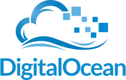

PyCon Philippines
=================

PyCon Philippines is a volunteer-run, not-for-profit conference centered around
the Python Programming language.

The main goal of this conference is to provide a venue where the Python
programming language and surrounding technologies can be explored, discussed and
exercised.

We have an interest to gather software engineers, programming enthusiasts, 
startup founders, corporate IT decision makers, students and IT educators in a 
2-day event where we can collaborate and learn with each other.

.. toctree::
   :maxdepth: 3

   theme
   date-and-venue
   speakers
   volunteers
   coc
   past-pycons

Sponsors
--------

.. admonition:: Work in progress

   Sponsors area

Plantinum
^^^^^^^^^
Python Software Foundation

.. image:: _static/images/psf.png
   :target: http://www.python.org/psf/
   
The Python Software Foundation (PSF) is a 501(c)(3) non-profit corporation that holds the intellectual property rights behind the Python programming language. We manage the open source licensing for Python version 2.1 and later and own and protect the trademarks associated with Python. We also run the North American `PyCon <http://us.pycon.org/>`_ conference annually, support other Python conferences around the world, and fund Python related development with our `grants program <http://www.python.org/psf/grants/>`_ and by funding special projects.    

SmartDevNet

.. image:: _static/images/smart-devnet.png
:target: http://www1.smart.com.ph/developer/

The SMART Developer Network (also known as SMART DevNet) is SMART Communications' developer community program, targeted at developers on desktop and mobile platforms interested in using SMART's technology platforms such as network tools and APIs. We promote general awareness of mobile apps development and "technopreneurship" thorough related groups like the IdeaSpace Foundation. We also strive to be a catalyst for fostering a vibrant developer community in the Philippines by organizing our own developer events as well as sponsoring other developer groups' events and meetups. 

Silver
^^^^^^

Github
.. image:: _static/images/github.svg
:target: https://github.com/
   
GitHub is the best way to build software together. GitHub provides tools for easier collaboration and code sharing from any device. Start collaborating today — open source project hosting is free!    

Gold
^^^^

Django Software Foundation

:target: https://www.djangoproject.com/foundation/

The Django Software Foundation is a US-based non-profit organisation with the mission to promote, support, and advance the `Django Web framework <https://www.djangoproject.com/>`_. The DSF sponsors sprints, meetups, gatherings and community events, and protects the intellectual property of the Django project. 

Concentrix
.. image:: _static/images/concentrix.png
:target: http://concentrix.com/
   
Concentrix offers many exciting employment opportunities that will take you as far as your ambition and desire can go. We specialize in technical support and new technology-related project initiatives, and we are expanding our call center service capabilities.    

Bronze
^^^^^^

Infoshift
.. image:: _static/images/infoshift.png
:target: http://www.infoshiftinc.com/
   
Collabspot
.. image:: _static/images/collabspot.svg
:target: http://www.collabspot.com/
   
Eastvantage
.. image:: _static/images/eastvantage.png
:target: http://www.eastvantage.com/

engageSpark
.. image:: _static/images/engagespark.png
:target: http://www.engagespark.com/

Ingenuity
.. image:: _static/images/ingenuity.svg
:target: http://ingenuity.ph/
   
Marketing Sponsor
^^^^^^^^^^^^^^^^^

Save22
.. image:: _static/images/save22.png
:target: http://www.save22.com/
   
Digital Ocean

:target: https://www.digitalocean.com/
   
Two Scoops Press
.. image:: _static/images/twoscoopspress.png
:target: http://twoscoopspress.com/

Co-organizer
^^^^^^^^^^^^

.. pending: Ateneo de Manila

.. pending: Others
.. pending: ^^^^^^

.. pending: Oracle
.. pending: Coins.ph
.. pending: Titanium
.. pending: Ideaspace
.. pending: Google
.. pending: Globe
.. pending: Icannhas
.. pending: KLab Cyscorpions
.. pending: Heroku

Sponsorship Packages
^^^^^^^^^^^^^^^^^^^^

+----------------------------------------------------------------------------------------------------+-----------+----------+----------+
|                                                                                                    | Diamond   | Platinum | Gold     |
+----------------------------------------------------------------------------------------------------+-----------+----------+----------+
| PHP amount (minimum investment)                                                                    | 100,000   | 50,000   | 15,000   |
+====================================================================================================+===========+==========+==========+
| Mention during breaks, welcome and closing remarks, and set-up phase                               | ✔         | ✔        | ✔        |
+----------------------------------------------------------------------------------------------------+-----------+----------+----------+
| Placement on banners at conference                                                                 | ✔         | ✔        | ✔        |
+----------------------------------------------------------------------------------------------------+-----------+----------+----------+
| Logos w/ appropriate positioning on event handouts                                                 | ✔         | ✔        | ✔        |
+----------------------------------------------------------------------------------------------------+-----------+----------+----------+
| Logo/Link on website                                                                               | ✔         | ✔        | ✔        |
+----------------------------------------------------------------------------------------------------+-----------+----------+----------+
| Text description of your company on the website                                                    | ✔         | ✔        | ✔        |
+----------------------------------------------------------------------------------------------------+-----------+----------+----------+
| One (1) sponsored job ad posting on http://jobs.python.ph/ at the top of other listings (3 months) | ✔         | ✔        |          |
+----------------------------------------------------------------------------------------------------+-----------+----------+----------+
| Opportunity to speak about your organization during a break (1 minute)                             | ✔         | ✔        |          |
+----------------------------------------------------------------------------------------------------+-----------+----------+----------+
| Flash ad as screensaver during breaks (logo or image)                                              | ✔         |          |          |
+----------------------------------------------------------------------------------------------------+-----------+----------+----------+
| Table/Booth at Venue on Day 1                                                                      | ✔         |          |          |
+----------------------------------------------------------------------------------------------------+-----------+----------+----------+
| # of free tickets to the 2-day event                                                               | 5         | 3        | 2        |
+----------------------------------------------------------------------------------------------------+-----------+----------+----------+
| X flyers per giveaway bag                                                                          | 3         | 3        | 1        |
+----------------------------------------------------------------------------------------------------+-----------+----------+----------+
| X promo items per giveaway bag                                                                     | 3         | 3        | 1        |
+----------------------------------------------------------------------------------------------------+-----------+----------+----------+

