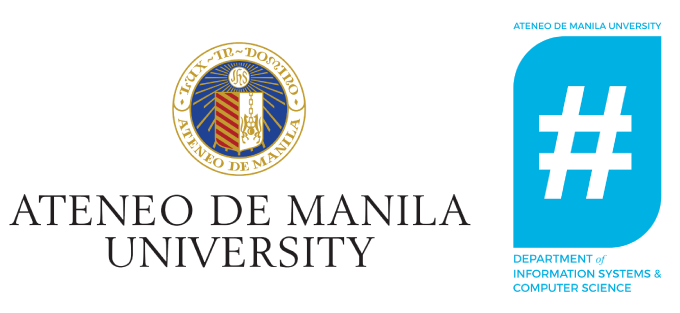
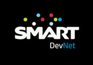

PyCon Philippines 2015
======================

PyCon Philippines is a `volunteer-run <http://pycon.python.ph/volunteers.html>`_, not-for-profit conference centered around
the Python Programming language.

The main goal of this conference is to provide a venue where the Python
programming language and surrounding technologies can be explored, discussed and
exercised.

We have an interest to gather software engineers, programming enthusiasts,
startup founders, corporate IT decision makers, students and IT educators in a
2-day event where we can collaborate and learn with each other.

.. toctree::
   :maxdepth: 2

   theme
   date-and-venue
   speakers
   talks
   communities
   schedule
   tickets
   volunteers
   coc
   past-pycons
   sponsorship

Organizers
----------
PyCon PH 2015 is brought to you by:

.. image:: _static/images/pythonph.svg
  :target: https://www.linkedin.com/grp/home?gid=6511985
  :width: 180px

Sponsors
--------

Platinum Sponsors
^^^^^^^^^^^^^^^^^

Python Software Foundation
""""""""""""""""""""""""""

.. image:: _static/images/sponsors/psf.png
  :target: https://www.python.org/psf/

The Python Software Foundation (PSF) is a 501(c)(3) non-profit corporation that holds the intellectual property rights behind the Python programming language. We manage the open source licensing for Python version 2.1 and later and own and protect the trademarks associated with Python. We also run the North American PyCon conference annually, support other Python conferences around the world, and fund Python related development with our grants program and by funding special projects.

Datalicious
"""""""""""

.. image:: _static/images/sponsors/datalicious.png
  :target: http://www.datalicious.com/

Datalicious is a full service, worldwide, data agency providing client focused solutions designed to scale with your organisation. From humble beginnings as a data consulting agency in Australia, Datalicious has expanded through our growing services division and product development teams. We now help our clients around the globe achieve best practice data driven marketing through best of breed technology and data driven thinking.

It’s called smart data driven marketing. It’s Datalicious.

KLab Cyscorpions
""""""""""""""""

We are a mobile company make games and services for smartphone.
We drill our skills and make our best effort for ourselves, our users
and society.

Gold Sponsors
^^^^^^^^^^^^^

Django Software Foundation
""""""""""""""""""""""""""

.. image:: _static/images/sponsors/django.png
  :target: https://www.djangoproject.com/foundation/

The Django Software Foundation is a US-based non-profit organisation with the mission to promote, support, and advance the `Django Web framework <https://www.djangoproject.com/>`_. The DSF sponsors sprints, meetups, gatherings and community events, and protects the intellectual property of the Django project.

APPone
""""""

APPone Corp. was established especialy for the programming of the APPone ERP System for the fashion industry. A subsidiary of the German SACO Software and Consulting GmbH.

Ingenuity
"""""""""

Ingenuity Global Consulting, Inc. is a web and mobile development agency specializing in Python/Django, iOS and Android. It uses Scrum in software development and has Certified ScrumMasters in the team. Ingenuity, also provides staff augmentation, project consultation, UI/UX design, QA/testing and server maintenance services.

Scrapinghub
"""""""""""

.. image:: _static/images/sponsors/scrapinghub.png
  :target: http://scrapinghub.com/

Scrapinghub uses Python to deliver successful web crawling and data processing solutions. Our platform as a service allows your organization to build crawlers easily, deploy them instantly and scale them on demand. Our services cover all aspects of web crawling, from automatic data extraction to javascript rendering and effortless proxy management. We are the company behind `Scrapy <http://scrapy.org>`_, the popular open-source web crawling framework for Python.

Revsys
""""""

We are performance tuners, Django and PostgreSQL experts, infrastructure and scaling architects. Our clients come to us for our deep and varied experience. We offer technical support and consultation for complex open source systems. Revolution Systems specializes in performance and scalability, Django web application development, Systems Administration services and commercial support of many Open Source Software systems.

ZipMatch
""""""""

.. image:: _static/images/sponsors/zipmatch.png
  :target: http://www.zipmatch.com/

Founded in 2013, ZipMatch is the country’s most innovative home buying marketplace aimed at educating and empowering the Filipino home buyer and renter. Some of the website’s features include home matching through its comprehensive residential project pages, wherein home buyers can explore 360 degree views of the property, search door to door with it’s nearby projects map, and read property reviews. More than just a listing site, ZipMatch wants to promote smart home ownership in the Philippines.

IntroMe
"""""""

IntroMe is a social networking service that enables you to connect via geolocation with other identity-validated users with similar interests. The app makes meeting new people outside your network easier than ever. IntroMe makes intros based on shared interests by using geolocation and our unique TrustGuard score, which you can quickly evaluate how close the intro is to you and how trustworthy they are. Want to take the intro offline? Simply click “Meet Now” and start a conversation. By delivering safe, interest-based intros to your fingertips, IntroMe takes the guess work out of meeting new people.

Freelancer.com
""""""""""""""

.. image:: _static/images/sponsors/freelancer.png
  :target: https://www.freelancer.com/

Freelancer.com is the world’s largest freelancing and crowdsourcing marketplace by number of users and projects. We connect over 15,789,700 employers and freelancers globally from over 247 countries, regions and territories. Through our marketplace, employers can hire freelancers to do work in areas such as software development, writing, data entry and design right through to engineering, the sciences, sales and marketing, accounting and legal services.

Chikka
""""""

.. image:: _static/images/sponsors/chikka.png
  :target: http://www.chikka.com/

Ever since launching the iconic Chikka Text Messenger in 2000, the pioneering applications developer has evolved into an incubator for new technologies and innovation, producing telco-grade platforms and real value-added services for the new digital and mobile generation.
The company’s mission, first stated in 2000, is “to bring together communities, heretofore separated by geographical barriers and differences in technology.”
Chikka is a wholly-owned subsidiary of Voyager Innovations.

Titanium Technologies
"""""""""""""""""""""

.. image:: _static/images/sponsors/titanium.png
  :target: http://www.titanium.ph/

Titanium Technologies is a Philippine software company founded in 1991 by Jerry Tieng, Kelvin Te, and Roger Te Un Son - engineers whose formative years were spent growing up in the early days of the PC revolution. Best of friends, the three founded the company right out of engineering school and focused on serving the IT requirements of small- and medium-sized companies.

Marketing Partners
^^^^^^^^^^^^^^^^^^

JetBrains PyCharm
"""""""""""""""""

.. image:: _static/images/sponsors/pycharm.png
  :target: https://www.jetbrains.com/pycharm/

JetBrains PyCharm — Python IDE with complete set of tools for productive
development with Python programming language. In addition, the IDE
provides high-class capabilities for professional Web development with Django
framework.

Technology Partners
^^^^^^^^^^^^^^^^^^^

Smart Developer Network
"""""""""""""""""""""""

Media Partners
^^^^^^^^^^^^^^

WhenInManila.com
""""""""""""""""

WhenInManila.com is the top online magazine in Manila and the Philippines.

Aktivshow.com
"""""""""""""

.. image:: _static/images/sponsors/activshow.jpg
  :target: http://www.aktivshow.com

Your portal for unlimited events.

